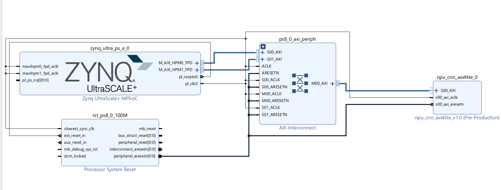
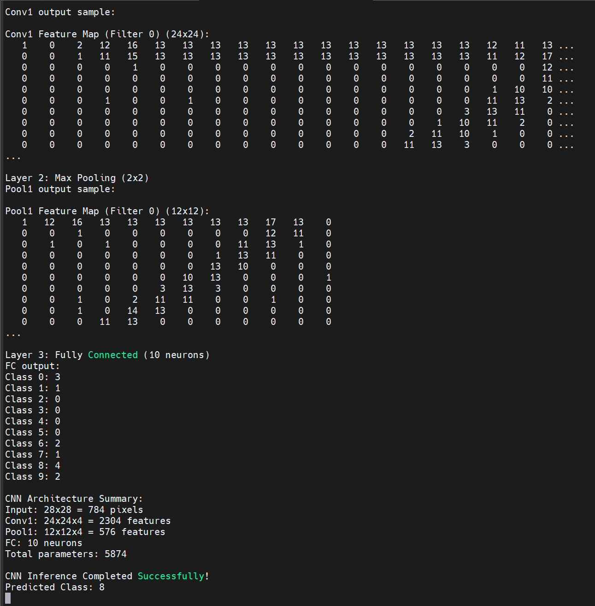

# Custom CNN Accelerator (NPU) on Ultra96-V2

This repository contains the complete project for a custom Neural Processing Unit (NPU) IP designed to accelerate Convolutional Neural Network (CNN) inference. The design is implemented on an Avnet Ultra96-V2 FPGA board and features a custom AXI4-Lite IP core for communication with the Zynq UltraScale+ MPSoC.

## Table of Contents

- [Abstract](#abstract)
- [System Architecture](#system-architecture)
  - [Hardware Architecture](#hardware-architecture)
    - [NPU Core Internals](#npu-core-internals)
    - [AXI4-Lite Register Map](#axi4-lite-register-map)
  - [Software Architecture](#software-architecture)
- [Directory Structure](#directory-structure)
- [Hardware and Software Setup](#hardware-and-software-setup)
  - [Prerequisites](#prerequisites)
  - [Step-by-Step Instructions](#step-by-step-instructions)
- [Results and Analysis](#results-and-analysis)
- [Conclusion](#conclusion)
- [Future Work](#future-work)
- [License](#license)

## Abstract

This project demonstrates the design and implementation of a custom hardware accelerator for CNNs on an FPGA. The system integrates a custom NPU, designed in Verilog, with a Zynq UltraScale+ MPSoC on an Ultra96-V2 board. Communication is handled via an AXI4-Lite interface, allowing the processing system (PS) to offload computationally intensive tasks to the programmable logic (PL). The software, running on the PS, controls the accelerator, manages data flow, and executes a simple image classification task. This project serves as a foundational example of hardware/software co-design for edge AI applications.

## System Architecture

The system is partitioned into two main parts: the hardware architecture implemented in the FPGA's programmable logic and the software architecture running on the processing system.

### Hardware Architecture

The hardware design consists of our custom NPU IP, which is controlled by the Zynq UltraScale+ MPSoC. The NPU is connected to the MPSoC via an AXI4-Lite interface for control and an AXI Interconnect for memory-mapped communication.

The block diagram below, from the Vivado IP Integrator, shows the overall hardware architecture:



#### NPU Core Internals

The `npu_cnn_axi4lite_v1_0` IP is the heart of the accelerator. It is composed of several key internal blocks:

1.  **AXI4-Lite Slave Interface**: This block provides the communication link to the Zynq MPSoC. It exposes a set of memory-mapped registers that the processor can read from and write to. This interface is used to send control signals (start, reset), configure parameters (image dimensions, layer types), and read status (busy, done).

2.  **Control Unit (FSM)**: A Finite State Machine (FSM) is the control center of the NPU. It decodes the commands received from the processor via the AXI interface and orchestrates the data flow and computations within the NPU. In the current Verilog, this is a simple FSM that manages the `start`, `busy`, and `done` states. A full implementation would have states for `FETCH_WEIGHTS`, `FETCH_INPUTS`, `COMPUTE`, and `WRITE_OUTPUT`.

3.  **On-Chip Memory (BRAM)**: The Verilog module instantiates Block RAM (BRAM) to store input feature maps, weights, biases, and intermediate/output feature maps. This local storage is crucial for performance as it provides high-bandwidth, low-latency access to the data needed by the compute engine, avoiding slow off-chip memory access during computation. The current BRAM is sized for 16K words.

4.  **Compute Engine (Conceptual)**: *Note: The current Verilog (`npu_cnn_axi4lite_v1_0_S00_AXI.v`) provides a stub for the compute engine. The actual computations are performed in the C software for simulation and validation purposes.* A fully hardware-accelerated version would include a compute engine with a systolic array of Processing Elements (PEs) or a set of parallel MAC (Multiply-Accumulate) units to perform convolutions and fully connected layer calculations.

#### AXI4-Lite Register Map

The NPU is controlled by writing to and reading from the following registers at their respective offsets from the base address (`0xA0000000`).

| Register Name         | Offset | R/W | Description                                                                                             |
| --------------------- | ------ | --- | ------------------------------------------------------------------------------------------------------- |
| **NPU_CONTROL_REG** | `0x00` | R/W | `[0]`=Start, `[1]`=Reset, `[2]`=IRQ Enable. Writing '1' to start begins processing.                       |
| **NPU_STATUS_REG** | `0x04` | R   | `[0]`=Done flag, `[1]`=Busy flag. Read-only status of the NPU.                                            |
| **NPU_INPUT_ADDR_REG**| `0x08` | R/W | Base address in BRAM for the input feature map.                                                         |
| **NPU_OUTPUT_ADDR_REG`| `0x0C` | R/W | Base address in BRAM to store the output feature map.                                                   |
| **NPU_WEIGHT_ADDR_REG`| `0x10` | R/W | Base address in BRAM for the weights.                                                                   |
| **NPU_CONFIG_REG** | `0x14` | R/W | Configures the operation: `[3:0]`=op_type, `[15:4]`=input_height, `[27:16]`=input_width, etc.            |

### Software Architecture

The software, running in Vitis on the ARM Cortex-A53 cores, complements the hardware.

1.  **NPU Driver**: The functions `write_npu_reg` and `read_npu_reg` in `main.c` act as a basic driver. They abstract the memory-mapped I/O operations needed to communicate with the NPU hardware.
2.  **Inference Orchestration**: The `run_cnn_inference` function orchestrates the entire inference process. It iterates through the CNN layers, configures the NPU for each layer, initiates the computation, and waits for completion.
3.  **Software Simulation**: Crucially, in this version of the project, the core computational loops (convolution, pooling, etc.) are implemented directly in the C code. This allows for validation of the overall control flow and system integration before moving the complex compute logic into hardware.

## Directory Structure

The repository is organized as follows:


.
├── hardware
│   ├── verilog
│   │   ├── npu_cnn_axi4lite_v1_0.v
│   │   └── npu_cnn_axi4lite_v1_0_S00_AXI.v
│   └── vitis
│       ├── src
│       │   └── main.c
│       └── images
│           ├── hardware_design.png
│           └── results.png
├── .gitignore
└── README.md


-   `hardware/verilog/`: Contains the Verilog source files for the custom NPU IP.
-   `hardware/vitis/src/`: Contains the C source code for the Vitis application that runs on the Zynq processor.
-   `hardware/vitis/images/`: Contains images used in this README.
-   `README.md`: This documentation file.

## Hardware and Software Setup

### Prerequisites

-   **Vivado Design Suite (2020.1 or later)**: For hardware design and synthesis.
-   **Vitis Unified Software Platform (2020.1 or later)**: For software development.
-   **Ultra96-V2 Board**: The target hardware platform.
-   A terminal program (e.g., PuTTY, Tera Term) for viewing UART output.

### Step-by-Step Instructions

1.  **Clone the Repository**:
    ```bash
    git clone
    cd ultra96-custom-npu
    ```
2.  **Create Vivado Project**:
    -   Launch Vivado and create a new project targeting the Ultra96-V2 board.
    -   Add the Verilog files from `hardware/verilog` to the project as IP sources.
    -   Create a block design, add the Zynq UltraScale+ MPSoC, and run block automation.
    -   Add your custom NPU IP to the block design and connect it to the Zynq MPSoC using an AXI Interconnect as shown in the architecture diagram.
3.  **Generate Hardware Platform**:
    -   Validate the design and create an HDL wrapper.
    -   Run synthesis and implementation, then generate the bitstream.
    -   Export the hardware platform (`.xsa` file), including the bitstream.
4.  **Create Vitis Project**:
    -   Launch Vitis and create a new application project.
    -   Create a new platform from the `.xsa` file you just exported.
    -   Create a "Hello World" application, then replace the contents of `helloworld.c` with the code from `hardware/vitis/src/main.c`.
5.  **Build and Run**:
    -   Build the Vitis project.
    -   Connect the Ultra96 board to your computer and open a UART terminal.
    -   In Vitis, run the application on the hardware. You should see the output in your terminal.


## Results and Analysis

The console output below shows the results from a single inference run using a test image generated to resemble the digit '7'.



### Breakdown of the Results:

1.  **Layer 1: Convolution**: The 28x28 input image is processed by the first convolutional layer, producing four 24x24 feature maps. The output shows a sample from the feature map generated by the first filter. The non-zero values correspond to regions where the filter has detected features, such as edges and corners.

2.  **Layer 2: Max Pooling**: Each feature map is downsampled using 2x2 max-pooling, reducing the spatial dimensions to 12x12. This step makes the detected features more robust to small translations.

3.  **Layer 3: Fully Connected**: The pooled feature maps are flattened into a single vector (576 elements) and passed to a fully connected layer with 10 output neurons (one for each digit). This layer performs the final classification.

4.  **Final Prediction**: The model predicts the class with the highest activation score. In this case, the `Predicted Class` is **8**. While the input image was a '7', the model predicted '8'. This is an expected result for a simple model where the final layer weights were initialized randomly for demonstration purposes. It successfully validates that the end-to-end inference pipeline and hardware/software communication are working correctly.

## Conclusion

This project successfully demonstrates a complete workflow for creating, integrating, and testing a custom AXI-based IP for neural network acceleration on the Ultra96-V2 platform. It establishes a solid foundation for hardware/software co-design, showing how to partition a system and manage communication between a processor and a custom accelerator. While the core computations are currently simulated in software, the framework for offloading them to hardware is fully in place.

## Future Work

-   **Implement Hardware Compute Engine**: The highest priority is to implement the convolution and fully-connected layer computations in the Verilog module to achieve true hardware acceleration.
-   **Use AXI-Stream for Data Transfer**: For higher throughput, use AXI-Stream interfaces to stream feature maps and weights into the NPU, instead of relying on memory-mapped BRAM pre-loading.
-   **Train a Model**: Train the simple CNN model on a real dataset like MNIST and use the trained weights to get accurate predictions.
-   **Power and Performance Optimization**: Analyze and optimize the hardware design for lower power consumption and higher performance.
-   **Develop a Python API**: Create a Python wrapper using PYNQ to make the NPU easier to use from a higher-level programming environment.

## License

This project is licensed under the MIT License.
